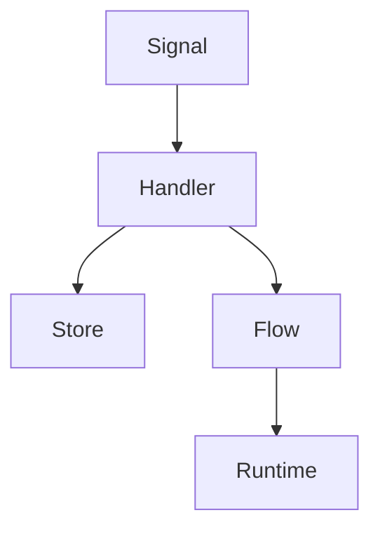

# Contributing to AgentForge

Welcome to AgentForge! This guide will help you understand how to contribute to the project effectively.

## Core Architecture

AgentForge is built on a signal-driven architecture with these core components:



## Development Guidelines

### 1. Coding Standards

- **Functional Approach**: Use immutable data structures and pure functions where possible
- **Pattern Matching**: Prefer pattern matching over conditional logic
- **Documentation**: All public functions must have `@doc` and `@moduledoc` comments
- **Testing**: Maintain test coverage for all new code
- **Error Handling**: Use tagged tuples (`{:ok, result}` or `{:error, reason}`)

Example of good code style:

```elixir
@doc """
Creates a new primitive that processes signals.

## Examples

    iex> my_primitive = create_primitive(opts)
    iex> signal = Signal.new(:test, "data")
    iex> {{:emit, result}, state} = my_primitive.(signal, %{})
"""
def create_primitive(opts) do
  fn signal, state ->
    case process(signal, state) do
      {:ok, result} -> {{:emit, result}, state}
      {:error, reason} -> {{:emit, Signal.new(:error, reason)}, state}
    end
  end
end
```

### 2. Extending Primitives

When adding new primitives:

1. **Interface Consistency**: Follow the standard primitive interface:
   ```elixir
   fn signal, state -> {result, new_state} end
   ```

2. **Result Types**: Use these standard result formats:
   - `{:emit, signal}`: Single signal emission
   - `{:emit_many, signals}`: Multiple signal emission
   - `{:halt, result}`: Stop processing
   - `{:wait, reason}`: Pause processing
   - `{:error, reason}`: Error condition

3. **State Management**: Preserve state immutability and handle updates properly

4. **Error Handling**: Gracefully handle all error cases

5. **Documentation**: Include clear examples in documentation

Example of a new primitive:

```elixir
@doc """
Creates a filter primitive that only passes signals meeting a condition.

## Examples

    iex> filter = AgentForge.Primitives.filter(&(&1.data > 10))
    iex> signal = Signal.new(:value, 15)
    iex> {{:emit, result}, _} = filter.(signal, %{})
"""
def filter(condition) when is_function(condition, 1) do
  fn signal, state ->
    if condition.(signal) do
      {{:emit, signal}, state}
    else
      {:skip, state}
    end
  end
end
```

### 3. Testing Requirements

1. **Test Coverage**: All primitives must have tests for:
   - Happy path behavior
   - Error conditions
   - Edge cases
   - State management

2. **Test Organization**: Use descriptive `describe` and `test` blocks

3. **Assertions**: Make specific assertions about results

Example test structure:

```elixir
describe "primitive_name/2" do
  test "handles successful case" do
    # Setup
    primitive = Primitives.create_primitive(opts)
    signal = Signal.new(:test, "data")
    
    # Execute
    {{:emit, result}, new_state} = primitive.(signal, initial_state)
    
    # Assert
    assert result.type == :expected_type
    assert result.data == "expected_data"
    assert new_state.key == "expected_value"
  end

  test "handles error cases" do
    # Similar structure for error conditions
  end
end
```

## Pull Request Process

1. **Branch Naming**:
   - `feature/` for new features
   - `fix/` for bug fixes
   - `docs/` for documentation updates

2. **Commit Messages**: Follow conventional commits format:
   ```
   type(scope): description

   [optional body]

   [optional footer]
   ```

3. **PR Description**:
   - Clear description of changes
   - Reference any related issues
   - Include test coverage report
   - List breaking changes if any

4. **Review Process**:
   - All PRs require at least one review
   - All tests must pass
   - Documentation must be updated
   - No linter warnings

## Running Tests

```bash
# Run all tests
mix test

# Run specific test file
mix test test/agent_forge/primitives_test.exs

# Run with coverage
mix test --cover
```

## Getting Help

- Open an issue for bugs or feature requests
- Start a discussion for architectural questions
- Tag maintainers for urgent issues

## License

By contributing, you agree to license your work under the project's MIT license.
