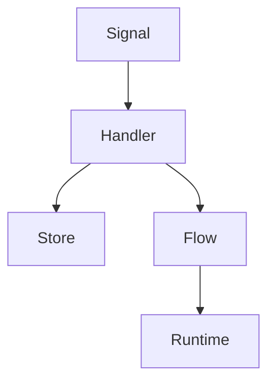

# AgentForge

AgentForge is a lightweight, signal-driven workflow framework for Elixir, designed for building flexible and maintainable data processing pipelines.



## Features

- 🔄 **Signal-driven Architecture**: Build workflows around immutable signals
- 🧩 **Composable Primitives**: Core building blocks for common patterns
- 🔀 **Flexible Flows**: Chain handlers into dynamic processing pipelines
- 📦 **State Management**: Track and update workflow state
- ⚡ **Async Support**: Handle asynchronous operations
- 🛠 **Configuration-based**: Define workflows in YAML
- 💪 **Type-safe**: Leverages Elixir's pattern matching

## Quick Start

```elixir
# Add to mix.exs
def deps do
  [
    {:agent_forge, "~> 0.1.0"}
  ]
end

# Run
mix deps.get
```

### Simple Example

```elixir
defmodule Example do
  alias AgentForge.{Flow, Signal, Primitives}

  def run do
    # Define workflow steps
    validate = Primitives.transform(fn data ->
      if data.valid?, do: data, else: raise "Invalid data"
    end)

    process = Primitives.transform(fn data ->
      Map.put(data, :processed, true)
    end)

    notify = Primitives.notify(
      [:console],
      format: &("Processed: #{inspect(&1)}")
    )

    # Compose workflow
    workflow = [validate, process, notify]

    # Execute
    signal = Signal.new(:start, %{valid?: true})
    {:ok, result, _state} = Flow.process(workflow, signal, %{})
    IO.inspect(result)
  end
end
```

## Core Components

### Signals
Immutable messages that flow through the system:
```elixir
signal = Signal.new(:user_action, %{id: 1})
```

### Primitives
Building blocks for common patterns:
- **Branch**: Conditional processing
- **Transform**: Data modification
- **Loop**: Iteration handling
- **Wait**: Async operations
- **Notify**: Event notifications

### Flows
Compose handlers into pipelines:
```elixir
workflow = [&validate/2, &process/2, &notify/2]
```

## Documentation

- [Getting Started Guide](guides/getting_started.md)
- [Core Concepts](guides/core_concepts.md)
- [Contribution Guidelines](CONTRIBUTING.md)

## Examples

- [Data Processing](examples/data_processing.exs): Basic data transformation pipeline
- [Async Workflow](examples/async_workflow.exs): Handling async operations
- [Configuration-based](examples/config_workflow.exs): YAML-defined workflows

## Design Philosophy

AgentForge focuses on:
- **Simplicity**: Clean, understandable codebase
- **Flexibility**: Adaptable to various use cases
- **Maintainability**: Well-documented, tested code
- **Composability**: Build complex flows from simple parts

## Use Cases

- ✅ Data Processing Pipelines
- ✅ Event-driven Workflows
- ✅ Multi-step Validations
- ✅ Async Task Orchestration
- ✅ Business Process Automation

## Contributing

We welcome contributions! Please see our [Contributing Guide](CONTRIBUTING.md) for guidelines.

1. Fork the repository
2. Create your feature branch
3. Run tests (`mix test`)
4. Update documentation
5. Submit a pull request

## License

This project is licensed under the MIT License - see the [LICENSE](LICENSE) file for details.
